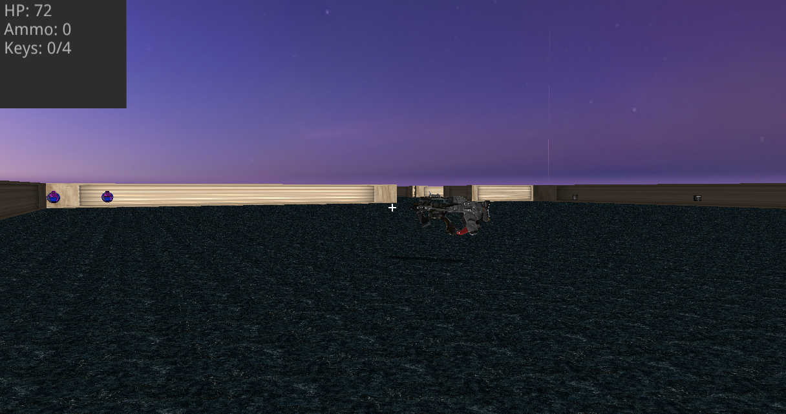

To compile my game you have to use ViennaVulkanEngine v1.1 : [https://github.com/hlavacs/ViennaVulkanEngine/tree/v1.1](https://github.com/hlavacs/ViennaVulkanEngine/tree/v1.1)

Create "Game" folder in ViennaVulkanEngine1.1\examples\ directory and move all files from this repository in ViennaVulkanEngine1.1\examples\Game\ directory. Also make sure CMakeLists.txt file in examples directory has add_subdirectory(Game) line.

To compile you can run next command in ViennaVulkanEngine1.1 directory: cmake --build build --target game --config Release

You can find game.exe file in ViennaVulkanEngine1.1\bin\Release directory.

Also if you want to change mouse sensitivity open MyEventListener.h file, find 	"float slow = 0.1; //camera rotation speed" line. And change the value.

Have fun!

All game models I have downloaded from www.cgtrader.com .

By the way, shots have a certain range, so you need to get close enough to the enemy to cause damage.

link to a video with gameplay:

https://youtu.be/6OL7Z6CJEgc

Screenshots:

